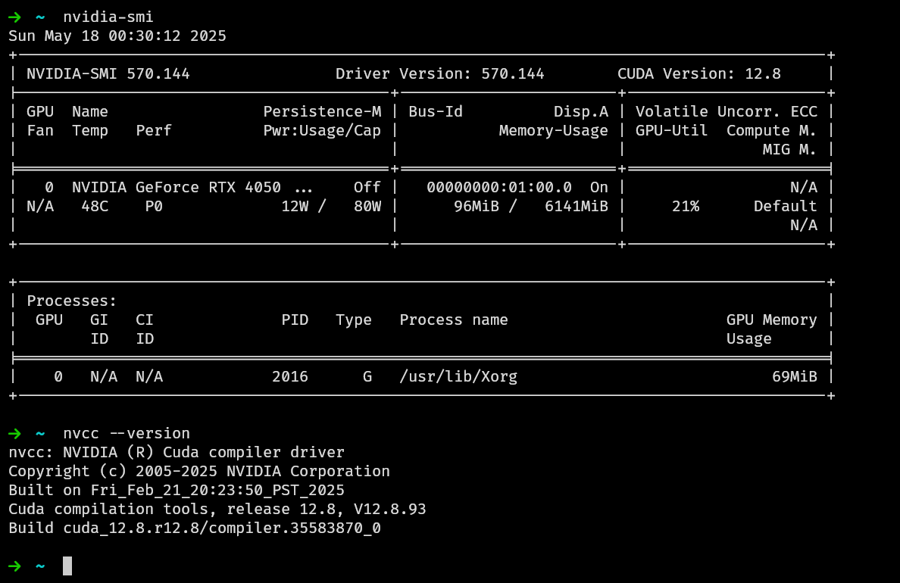
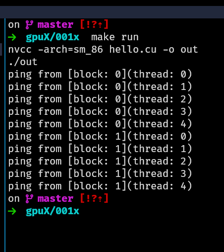

# DAY - 001

Today i have gone through a small introduction about the CUDA and its use cases.

Here are the links to the resources i have gone through:

- [The Current Deep Learning Ecosystem](https://github.com/Infatoshi/cuda-course/blob/master/01_Deep_Learning_Ecosystem/README.md#compilers)
- [Introduction to CUDA C++ Programming](https://docs.nvidia.com/cuda/cuda-c-programming-guide/index.html#introduction)

I have also set up the environment for CUDA programming. Here are the commands i have used to set up the environment:

```bash
sudo pacman -Syu
sudo pacman -S dkms nvidia-dkms nvidia-utils
sudo pacman -S cuda cuda-tools cudnn
```

Also BTW i use Arch Linux 😅

Now, we need to add the PATH to the `~/.bashrc` file.

```bash
# Set the path for the CUDA toolkit, cuDNN library and cuSPARSELt library
export CUDA_PATH=/opt/cuda
export PATH=$CUDA_PATH/bin:$PATH
export LD_LIBRARY_PATH=$CUDA_PATH/lib64:$LD_LIBRARY_PATH
export CPATH=$CUDA_PATH/include:$CPATH
export LIBRARY_PATH=$CUDA_PATH/lib64:$LIBRARY_PATH
export CUSPARSELT_PATH=/opt/cusparselt
export CPATH=$CUSPARSELT_PATH/include:$CPATH
export LIBRARY_PATH=$CUSPARSELT_PATH/lib:$LIBRARY_PATH
export LD_LIBRARY_PATH=$CUSPARSELT_PATH/lib:$LD_LIBRARY_PATH
```

Here are few screen shots of the setup:



I have also executed the first CUDA program (as the tradition itself) which is the hello world program.

To execute the program, use the commands:

```bash
make run
```

Output of the executed program:


